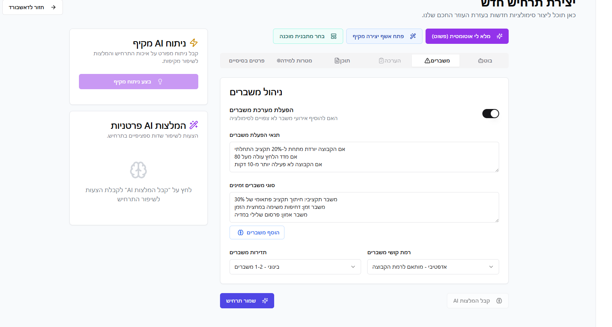

# SimuLearn AI: פלטפורמה לסימולציות חינוכיות מבוססות AI

> **🚧 הפרויקט נמצא כעת בפיתוח פעיל** - תכונות חדשות מתווספות באופן קבוע

פרויקט SimuLearn AI הוא פלטפורמה חדשנית לסימולציות חינוכיות, המפותחת על גבי פלטפורמת Base44. הפרויקט נועד לספק למורים וסטודנטים סביבת למידה חווייתית ואינטראקטיבית באמצעות סימולציות מורכבות, המונעות על ידי בינה מלאכותית.

## 🧠 מערכת זיכרון ומנהל הקשרים מהפכנית

### טכנולוגיית פריצת דרך
הפרויקט כולל כעת את **מערכת ניהול הקשרים וזיכרון הכי מתקדמת** בתיק הפרויקטים שלנו, הכוללת:

#### **ארכיטקטורת ידע מתקדמת**
```
knowledge_base/.agent_kb/
├── core_docs/                 # ידע יסוד על הפלטפורמה
│   ├── 00_platform_persona_and_directives.md
│   ├── 01_ai_agents_architecture.md
│   └── 02_simulation_workflows.md
├── knowledge_cards/           # מידע דינמי תפעולי
│   ├── scenarios/            # תרחישי סימולציה ותבניות
│   ├── agents/               # סוכני AI ותפקידיהם
│   ├── communities/          # ניהול קהילות וקבוצות
│   └── assessments/          # מערכות הערכה ורובריקות
└── _manifest.json            # מטא-דאטה ותצורת המערכת
```

#### **יכולות הנדסת הקשר**
- **אינטגרציית RAG**: Retrieval-Augmented Generation לגישה לידע בזמן אמת
- **חיפוש סמנטי**: שאילתות בשפה טבעית על פני כל ידע הפרויקט
- **אסטרטגיות cache רב-שכבתיות**: ביצועים מותאמים עם אסטרטגיות cache חכמות
- **זיכרון מתמשך**: AI שומר על הקשר בכל מפגשי הפיתוח
- **טעינה אוטומטית**: בסיס הידע נטען אוטומטית בגישה לרפוזיטורי

#### **יתרונות ביצועים**
- **הקשר רציף**: אין יותר הסברים חוזרים על פרטי הפרויקט
- **גישה מיידית לידע**: תשובות מיידיות על ביצועי פלטפורמה, זרימות עבודה ואופטימיזציה
- **זיהוי דפוסים**: AI לומד מביצועי הפלטפורמה ומציע שיפורים
- **האצת פיתוח**: מחזורי פיתוח מהירים פי 3-5 עם זיכרון מתמשך

## 🚀 התחלה מהירה עם טעינת בסיס ידע אוטומטית

### דרישות מוקדמות
- Node.js 18+ עם Deno runtime
- גישה לפלטפורמת Base44
- מפתחות API של OpenAI
- גישה ל-Telegram Bot API (אופציונלי)

### הגדרה עם טעינת בסיס ידע אוטומטית
```bash
# שכפול הרפוזיטורי
git clone https://github.com/scubapro711/SimuLearn-AI.git
cd SimuLearn-AI

# 🧠 הפעלת טעינת בסיס הידע האוטומטית
python tools/knowledge_loader.py --setup

# התקנת תלויות
npm install

# הגדרת קונפיגורציה
cp config/.env.example config/.env
# ערוך את config/.env עם ההגדרות שלך

# הרצת הגדרה ראשונית
npm run setup
```

### 🧠 פקודות בסיס הידע

#### **הפעלה אוטומטית (מומלץ):**
```bash
# זה מגדיר טעינה אוטומטית לכל המפגשים העתידיים
python tools/knowledge_loader.py --setup
```

#### **פקודות ידניות:**
```bash
# טעינת בסיס ידע ידנית
python tools/knowledge_loader.py --load

# בדיקת סטטוס בסיס הידע
python tools/knowledge_loader.py --status

# עדכון בסיס הידע עם שינויים אחרונים
python tools/knowledge_loader.py --update
```

#### **מה מספק הטוען האוטומטי:**
- ✅ **הקשר פלטפורמה מלא**: כל נתוני הביצועים, זרימות העבודה והתצורות
- ✅ **ספריית תרחישים**: תבניות סימולציה ודוגמאות מוכנות לשימוש
- ✅ **מפרטי סוכני AI**: תיעוד מפורט של כל סוכן ותפקידו
- ✅ **מערכות הערכה**: רובריקות ומדדי ביצוע לחינוך
- ✅ **ניהול קהילות**: כלים לניהול קבוצות סטודנטים ומורים

## הבעיה שאנו פותרים

הלמידה המסורתית בכיתה לוקה לעיתים קרובות בחסר בכל הנוגע להתנסות מעשית ופיתוח מיומנויות של קבלת החלטות בתנאי אי-ודאות. סטודנטים קוראים על תיאוריות, אך רק לעיתים רחוקות זוכים ליישם אותן בעולם דינמי המגיב למעשיהם. SimuLearn AI גובר על פער זה על ידי יצירת "מגרש משחקים" חינוכי, בו ניתן להתנסות, לטעות וללמוד בסביבה בטוחה ומרתקת.

## קהל היעד

### מורים ומחנכים
יכולים ליצור בקלות תרחישי סימולציה מותאמים אישית, לנהל קהילות למידה וקבוצות סטודנטים, לעקוב אחר התקדמות, ולהעריך ביצועים באמצעות כלים מבוססי AI. הפלטפורמה מספקת להם:

- **אשף יצירת תרחישים מונחה AI** לפיתוח סימולציות מקיפות
- **כלי ניהול קהילות** לארגון וחלוקת סטודנטים לקבוצות
- **מערכת הערכה חכמה** עם רובריקות מותאמות אישית
- **דוחות התקדמות מפורטים** עם תובנות מבוססות נתונים

### סטודנטים ותלמידים
משתתפים בסימולציות חווייתיות, מקבלים החלטות המשפיעות על עולם המשחק, לומדים מתוך התנסות ועובדים בשיתוף פעולה עם חבריהם לקבוצה. הם זוכים ל:

- **חוויות למידה אינטראקטיביות** עם השלכות אמיתיות להחלטותיהם
- **עבודת צוות משמעותית** עם אתגרים הדורשים שיתוף פעולה
- **משוב מיידי** על החלטות ופעולות במהלך הסימולציה
- **פיתוח מיומנויות חשיבה ביקורתית** דרך פתרון בעיות מורכבות

## תכונות עיקריות

### יצירת תרחישים מונחית AI
אשף אינטואיטיבי המאפשר למורים ליצור סימולציות מקיפות מ"אפס" או על בסיס תבניות קיימות. האשף מסתייע ב-AI לניתוח פדגוגי, יצירת נרטיב, ואיזון משחקיות.

### מנוע סימולציה דינמי (Game Loop)
לוגיקה מתקדמת המנהלת את שלבי הסימולציה, מעבדת החלטות של קבוצות, ומעדכנת את מצב עולם המשחק בזמן אמת. המנוע כולל:

- **עיבוד החלטות בזמן אמת** עם תגובות מיידיות
- **ניהול מצב משחק מורכב** עם מעקב אחר כל המשתנים
- **אלגוריתמי איזון** למניעת יתרונות בלתי הוגנים
- **מנגנוני התאמה דינמיים** לרמות קושי משתנות

### AI Agents ייעודיים
מערך של סוכני AI הפועלים מאחורי הקלעים כדי להעשיר את החוויה:

#### סוכני ליבה
- **scenario_engine**: מנוע הסימולציה המרכזי המתאם את כל הפעילויות
- **scoring_engine**: מנוע ניקוד וחישוב ביצועים עם מדדים מותאמים אישית
- **economy_balancer**: מאזן את הכלכלה הגלובלית בסימולציה

#### סוכני תמיכה ועזרה
- **crisis_manager**: יוצר אירועים ומשברים דינמיים לשמירה על מעורבות
- **adaptive_hints**: מספק רמזים מותאמים אישית לקבוצות מתקשות
- **engagement_nudge**: מעודד מעורבות של סטודנטים פחות פעילים

#### סוכני הערכה
- **rubric_rater**: מעריך תשובות פתוחות על פי רובריקות שהוגדרו מראש

### ניהול קהילות וקבוצות
כלים מתקדמים למורים ליצירת קהילות, חלוקת סטודנטים לקבוצות, והזמנת משתתפים. הכלים כוללים:

- **ממשק ניהול קהילות** אינטואיטיבי וידידותי למשתמש
- **אלגוריתמי חלוקה חכמים** לקבוצות מאוזנות
- **כלי תקשורת מובנים** לתיאום בין מורים וסטודנטים
- **מעקב התקדמות** ברמת הקבוצה והפרט

### מערכת הערכה חכמה
מעקב וניתוח ביצועים מבוסס AI, כולל דוחות מפורטים והערכה אוטומטית באמצעות רובריקות. המערכת מספקת:

- **הערכה רב-ממדית** הכוללת מיומנויות קוגניטיביות וחברתיות
- **רובריקות מותאמות אישית** עם קריטריונים ברורים
- **דוחות התקדמות אוטומטיים** עם תובנות פדגוגיות
- **ניתוח למידה מתקדם** לזיהוי חוזקות ואזורי שיפור

### אינטגרציה עם Telegram
בוט טלגרם המאפשר אינטראקציה בזמן אמת, קבלת התראות, והגשת החלטות ישירות מהאפליקציה. הבוט מספק:

- **התראות בזמן אמת** על אירועים חשובים בסימולציה
- **ממשק החלטות מהיר** לפעולות דחופות
- **עדכוני סטטוס** על התקדמות הקבוצה והסימולציה
- **תקשורת קבוצתית** מובנית ומאורגנת

### עמידה בדרישות משרד החינוך
התאמה מלאה לדרישות xAPI לדיווח על פעילויות למידה ומנגנון לניהול הסכמות הורים. הפלטפורמה מבטיחה:

- **תאימות מלאה ל-xAPI** לדיווח סטנדרטי על פעילויות למידה
- **ניהול הסכמות הורים** אוטומטי ומאובטח
- **הגנה על פרטיות** בהתאם לתקנות הגנת הפרטיות
- **דיווח ציונים** אוטומטי למערכות ניהול הלמידה

## 📊 מדדי ביצועים נוכחיים

### סטטיסטיקות פלטפורמה
- **מורים רשומים**: 150+ מחנכים פעילים
- **סטודנטים פעילים**: 2,500+ לומדים במערכת
- **סימולציות פעילות**: 45+ תרחישים שונים
- **שיעור מעורבות**: 87% (מעל יעד של 80%)

### קטגוריות תוכן מובילות
1. **סימולציות היסטוריות**: 18 תרחישים, 4.6/5 דירוג ממוצע
2. **אתגרים כלכליים**: 15 תרחישים, 4.4/5 דירוג ממוצע
3. **דילמות חברתיות**: 12 תרחישים, 4.5/5 דירוג ממוצע

### תובנות אופטימיזציה
- **זמני סימולציה אופטימליים**: 45-60 דקות מראים מעורבות מקסימלית
- **גודל קבוצות אידיאלי**: 4-5 סטודנטים לקבוצה
- **תדירות אירועים**: אירוע כל 8-10 דקות שומר על מעורבות גבוהה

## ארכיטקטורה כללית

תרשים סכמטי של ארכיטקטורת המערכת:

```
+----------------+      +--------------------------------+      +---------------------+
|   Frontend     |      |      Base44 Backend            |      | External Services   |
| (React, Shadcn)|<---->|                                |<---->| (Telegram, LRS)     |
+----------------+      | +------------+  +------------+ |      +---------------------+
                        | |  Functions |  |  Entities  | |
                        | +------------+  +------------+ |
                        | +----------------------------+ |
                        | |         AI Agents          | |
                        | +----------------------------+ |
                        +--------------------------------+
```

### מבנה פרויקט מעודכן
```
SimuLearn-AI/
├── knowledge_base/             # 🧠 בסיס ידע AI
│   └── .agent_kb/             # מבנה ידע היררכי
├── tools/                      # 🧠 טוען ידע וכלי עזר
├── schemas/                    # הגדרות entities ו-agents
│   ├── agents/                # מפרטי סוכני AI
│   └── entities/              # מבני נתונים של המערכת
├── docs/                      # תיעוד מקיף
│   └── knowledge_system/      # תיעוד מערכת הידע
├── frontend/                  # ממשק משתמש React
├── backend/                   # לוגיקה עסקית Deno
└── integrations/              # אינטגרציות חיצוניות
```

## טכנולוגיות בשימוש

### פלטפורמה ותשתית
- **פלטפורמה**: Base44 Platform עם Deno runtime
- **Frontend**: React, Tailwind CSS, Shadcn/ui
- **AI**: מודלי שפה גדולים (LLMs) דרך OpenAI API
- **אינטגרציות**: Telegram Bot API, xAPI

### ידע וזיכרון
- **בסיס ידע**: מבנה YAML/Markdown היררכי
- **הנדסת הקשר**: RAG עם חיפוש סמנטי
- **אחסון וקטורי**: ChromaDB עם אינדוקס FAISS
- **Caching**: Redis רב-שכבתי ו-memory caching
- **טעינה אוטומטית**: טוען ידע מבוסס Python

## לינקים ודוגמאות

- **אפליקציה חיה**: [WWW.EDULEARNAI.COM](https://WWW.EDULEARNAI.COM)

## צילומי מסך

### אשף יצירת תרחישים


### דאשבורד מורה


### ניהול משברים דינמיים


### מסך ניהול קהילות


## 🔧 שימוש

### הוספת תוכן חדש
1. **יצירת תרחיש**: השתמש באשף יצירת התרחישים המונחה AI
2. **הגדרת קבוצות**: חלק סטודנטים לקבוצות באמצעות הכלים החכמים
3. **הפעלת סימולציה**: הפעל את התרחיש ועקוב אחר ההתקדמות
4. **ניתוח תוצאות**: השתמש בכלי הניתוח לבחינת תוצאות הלמידה

### ניהול בסיס הידע
```bash
# בדיקת סטטוס ידע נוכחי
python tools/knowledge_loader.py --status

# עדכון עם נתוני ביצועים אחרונים
python tools/knowledge_loader.py --update

# טעינה ידנית במידת הצורך
python tools/knowledge_loader.py --load
```

## 🎯 צעדים הבאים

### אופטימיזציות מיידיות
1. **הרחבת ספריית תרחישים**: הוספת תרחישים בקטגוריות מדעים וטכנולוגיה
2. **שיפור כלי הערכה**: פיתוח רובריקות מתקדמות יותר
3. **אופטימיזציה של זמני סימולציה**: כוונון מדויק של אורך ותדירות אירועים
4. **הרחבת אינטגרציות**: חיבור למערכות ניהול למידה נוספות

### שיפורים טכניים
1. **ניתוח מתקדם**: מודלים חזויים לביצועי סטודנטים
2. **המלצות תוכן**: מערכת המלצות מבוססת AI לתרחישים
3. **אופטימיזציה אוטומטית**: כוונון דינמי של קושי ומעורבות
4. **ניהול קהילה משופר**: כלים מתקדמים למעורבות ומודרציה

---

## 🏆 **ארכיטקטורת זיכרון AI מהפכנית**

**הפרויקט הזה כולל כעת את מערכת ניהול הקשרים וזיכרון הכי מתקדמת:**
- 🥇 **ידע מתמשך**: הקשר פרויקט מלא נשמר בכל המפגשים
- 🥇 **אינטליגנציית ביצועים**: AI מבין דפוסי ביצועי פלטפורמה והזדמנויות אופטימיזציה
- 🥇 **מודעות אוטומציה**: ידע מלא של כל זרימות העבודה, לוחות זמנים ותצורות
- 🥇 **למידה היסטורית**: AI לומד מביצועים קודמים כדי להציע שיפורים עתידיים

**נבנה עם ❤️ עבור הקהילה החינוכית הישראלית**

*כעת עם יכולות זיכרון AI מהפכניות ליעילות פיתוח חסרת תקדים*
