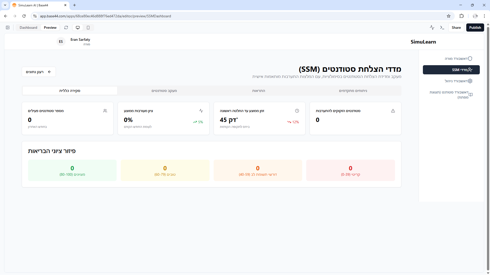

# SimuLearn AI: AI-Powered Educational Simulation Platform

> **🚧 Project is currently under active development** - New features are being added regularly

SimuLearn AI is an innovative educational simulation platform built on the Base44 platform. The project aims to provide teachers and students with an experiential and interactive learning environment through complex simulations powered by artificial intelligence.

## The Problem We're Solving

Traditional classroom learning often lacks practical experience and the development of decision-making skills under uncertainty. Students read about theories but rarely get to apply them in a dynamic world that responds to their actions. SimuLearn AI bridges this gap by creating an educational "playground" where students can experiment, make mistakes, and learn in a safe and engaging environment.

## Target Audience

*   **Teachers and Educators:** Can easily create customized simulation scenarios, manage learning communities and student groups, track progress, and assess performance using AI-powered tools.
*   **Students and Learners:** Participate in experiential simulations, make decisions that affect the game world, learn through experience, and collaborate with their group members.

## Key Features

*   **AI-Guided Scenario Creation:** An intuitive wizard that allows teachers to create comprehensive simulations from scratch or based on existing templates. The wizard uses AI for pedagogical analysis, narrative creation, and gameplay balancing.
*   **Dynamic Simulation Engine (Game Loop):** Advanced logic that manages simulation phases, processes group decisions, and updates the game world state in real-time.
*   **Dedicated AI Agents:** A suite of AI agents working behind the scenes to enrich the experience:
    *   `scenario_engine`: Central simulation engine.
    *   `scoring_engine`: Scoring and performance calculation engine.
    *   `economy_balancer`: Balances the global economy in the simulation.
    *   `crisis_manager`: Creates dynamic events and crises.
    *   `adaptive_hints`: Provides personalized hints to struggling groups.
    *   `engagement_nudge`: Encourages participation from less active students.
    *   `rubric_rater`: Evaluates open-ended responses based on predefined rubrics.
*   **Community and Group Management:** Tools for teachers to create communities, divide students into groups, and invite participants.
*   **Smart Assessment System:** AI-based performance tracking and analysis, including detailed reports and automatic assessment using rubrics.
*   **Telegram Integration:** Telegram bot enabling real-time interaction, notifications, and decision submission directly from the app.
*   **Ministry of Education Compliance:** Full compliance with xAPI requirements for learning activity reporting and digital parental consent management.

## Overall Architecture

Schematic diagram of the system architecture:

```
+----------------+      +--------------------------------+      +---------------------+
|   Frontend     |      |      Base44 Backend            |      | External Services   |
| (React, Shadcn)|<---->|                                |<---->| (Telegram, LRS)     |
+----------------+      | +------------+  +------------+ |      +---------------------+
                        | |  Functions |  |  Entities  | |
                        | +------------+  +------------+ |
                        | +----------------------------+ |
                        | |         AI Agents          | |
                        | +----------------------------+ |
                        +--------------------------------+
```

## Technologies Used

*   **Platform:** Base44 Platform
*   **Frontend:** React, Tailwind CSS, Shadcn/ui
*   **Backend Runtime:** Deno
*   **AI:** Large Language Models (LLMs) via OpenAI API
*   **Integrations:** Telegram Bot API, xAPI

## Links and Examples

*   **Live Application:** [WWW.EDULEARNAI.COM](https://WWW.EDULEARNAI.COM)

*   **Demo Videos:** (If available, add YouTube/Vimeo link here)

## Screenshots

### Scenario Creation Wizard


### Teacher Dashboard


### Dynamic Crisis Management


### Community Management Screen

